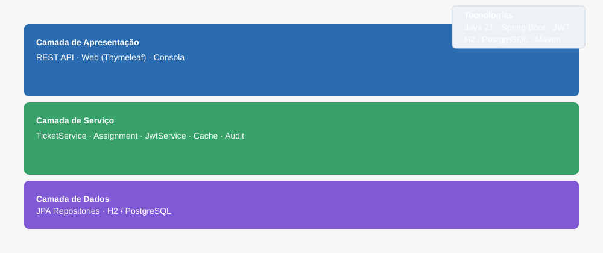
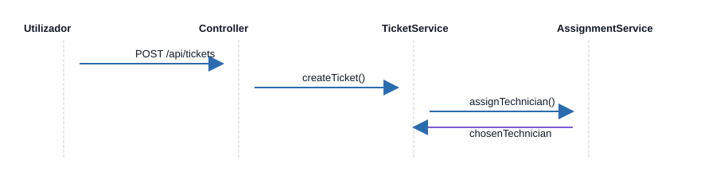
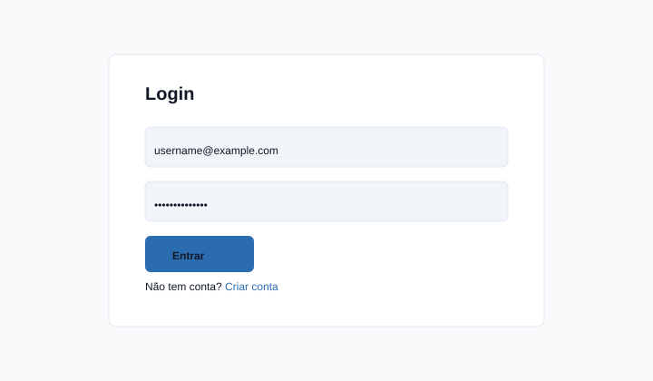

# ITSM System (itsm-system-java)

Sistema de Gestão de Infraestruturas e Incidentes (ITSM) desenvolvido em Java com Spring Boot. Fornece API REST, interface web (Thymeleaf), autenticação via JWT e um algoritmo de atribuição de técnicos.

Status: Documentação atualizada. Consulte `docs/manual-instalacao.md` e `docs/arquitetura.md` para instruções completas.

## Funcionalidades principais

- Gestão de tickets (criação, atualização, listagem)
- Atribuição automática de técnicos por carga e competências
- Gestão de técnicos, utilizadores, ativos e competências
- Autenticação e autorização com JWT
- API REST documentada com Swagger/OpenAPI

## Tecnologias

- Java 21 (LTS)
- Spring Boot
- Spring Data JPA (Hibernate)
- Spring Security + JWT
- H2 (desenvolvimento) / PostgreSQL (produção)
- Maven
- Thymeleaf

## Começar rapidamente

1. Clone o repositório:

```bash
git clone https://github.com/marciobruno-stack/itsm-system-java.git
cd itsm-system-java
```

2. Compilar e executar (usando o wrapper):

```bash
# Unix / macOS
./mvnw clean spring-boot:run

# Windows
mvnw.cmd clean spring-boot:run
```

3. Aceda a:

- Interface web: http://localhost:8080/
- Swagger UI: http://localhost:8080/swagger-ui/index.html
- H2 Console (desenvolvimento): http://localhost:8080/h2-console

Consulte `docs/manual-instalacao.md` para instruções detalhadas de configuração (H2 / PostgreSQL), criação de JAR, variáveis de ambiente e resolução de problemas.

## Diagramas e Capturas de Ecrã

Arquitetura (camadas):



Diagrama de sequência (atribuição de ticket):



Ecrã de Login (exemplo):




## Configuração rápida

- Defina `JWT_SECRET` ou ajuste `jwt.secret` no `application.properties` (não comite segredos).
- Para usar PostgreSQL, crie a base de dados e configure `spring.datasource.*` conforme `docs/manual-instalacao.md`.

## Endpoints principais

Veja a documentação Swagger para a lista completa. Principais endpoints:

- POST /api/auth/login — Autenticação (gera JWT)
- POST /api/auth/register — Registar utilizador
- GET /api/tickets — Listar tickets
- POST /api/tickets — Criar ticket
- GET /api/tecnicos — Listar técnicos

## Contribuição

1. Fork do repositório
2. Crie uma branch com a sua feature: `git checkout -b feature/nome-da-feature`
3. Faça commit das mudanças: `git commit -m "feat: descrição curta"`
4. Push para a branch: `git push origin feature/nome-da-feature`
5. Abra um Pull Request

## Contacto

Desenvolvedor: marcio.bruno.stack
- Email: marciobrruno@gmail.com
- GitHub: https://github.com/marciobruno-stack

---

Arquivos de documentação importantes:

- docs/manual-instalacao.md — Manual de instalação e utilização
- docs/arquitetura.md — Documentação da arquitetura
